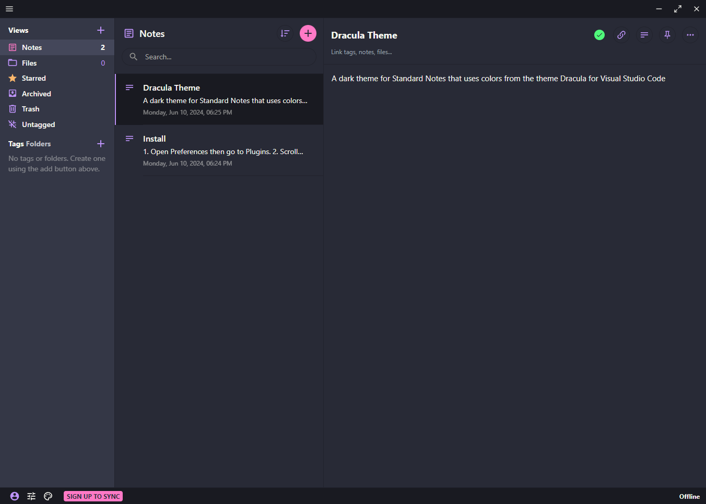

# Dracula Theme for [Standard Notes](https://standardnotes.com/)

> A dark theme for [Standard Notes](https://standardnotes.com/) that uses colors from the theme [Dracula for Visual Studio Code](https://github.com/dracula/visual-studio-code/)



## Install

1. Open Preferences then go to Plugins.
2. Scroll down to "Install Custom Plugin".
3. Copy and paste the install link below and press "Install".

```txt
https://cpod12.github.io/standard-notes-dracula-vs-code/ext.json
```
